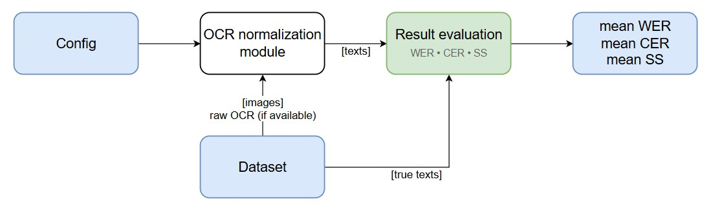
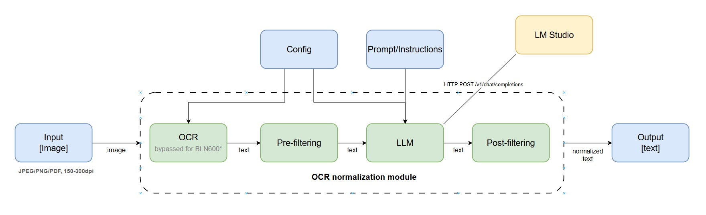

# ORCNorm: OCR Text Normalization Pipeline

OCR text normalization and correction pipeline using LLM-based strategies with configurable processing stages.

## Features

- **Dual-stage processing**: Cleanup + correction pipeline or single-stage strategy
- **Configurable LLM integration**: Support for local models via HTTP API
- **Flexible evaluation**: WER/CER with optional text normalization
- **Atomic checkpointing**: Safe progress saving for long runs
- **Deterministic execution**: Configurable seeding for reproducible results

## Architecture

### Overall Experiment Flow



The experiment follows this workflow:

1. **Configuration**: Load YAML config with dataset, LLM, and experiment settings
2. **Dataset**: Load OCR text and ground truth pairs from specified directories
3. **Normalization Module**: Process text through regex cleanup and optional LLM correction
4. **Result Evaluation**: Compute WER, CER, and semantic similarity metrics
5. **Output**: Save results with atomic checkpointing

### Normalization Pipeline



The normalization module supports:

- **Regex Cleanup**: Basic text normalization (whitespace, punctuation)
- **LLM Processing**: Optional AI-powered text correction
- **Strategy Selection**: Single-stage (cleanup/correction) or dual-stage (cleanup→correction)

## Quick Start

```bash
# Install dependencies
conda env create -f environment.yml
conda activate orcnorm

# Run inference with config
python scripts/run_inference.py --config config/bln600_mistral_correction.yaml

# Evaluate results
python scripts/evaluate_aggregates.py --results results/bln600_mistral_correction.yaml
python scripts/evaluate_metrics.py --results results/bln600_mistral_correction.yaml --out results/metrics.yaml
```

## Configuration

### Dataset Configuration

```yaml
dataset:
  name: BLN600
  path: TMP/bln600
  ocr_subdir: "OCR Text" # OCR text files subdirectory
  gt_subdir: "Ground Truth" # Ground truth files subdirectory
```

### LLM Configuration

```yaml
llm:
  use_llm: true # Enable/disable LLM processing
  model_name: "mistral-7b-instruct-v0.3"
  strategy: "full" # "cleanup", "correction", or "full" (cleanup+correction)
  temperature: 0.2
  seed: 42 # For deterministic generation
  timeout_seconds: 30 # Request timeout
  top_p: 0.7
  top_k: 50
  max_tokens: 4096
```

### Experiment Configuration

```yaml
experiment:
  output_path: results/bln600_mistral_correction.yaml
  checkpoint_every: 50 # Save progress every N samples (optional)
  normalize_before_eval: true # Normalize text before WER/CER calculation
  debug: true
```

## Processing Strategies

- **cleanup**: Single-stage text cleanup (remove artifacts, normalize spacing)
- **correction**: Single-stage text correction (fix spelling, grammar)
- **full**: Two-stage pipeline (cleanup → correction)

## Evaluation Metrics

- **WER**: Word Error Rate (with optional normalization)
- **CER**: Character Error Rate (with optional normalization)
- **SS**: Semantic Similarity (cosine similarity of embeddings)

### Text Normalization Options

When `normalize_before_eval: true` (default):

- Convert to lowercase
- Remove punctuation
- Collapse whitespace

When `normalize_before_eval: false`:

- Preserve case and punctuation
- Only normalize whitespace

## Environment Variables

```bash
LLM_ENDPOINT_URL=http://localhost:1234/v1/chat/completions
LLM_TIMEOUT_SECONDS=30
LLM_RETRY_ATTEMPTS=3
LLM_RETRY_BACKOFF=1.5
```

## Project Structure

```
ORCNorm/
├── config/                    # Configuration files
├── scripts/                   # Main execution scripts
│   ├── run_inference.py      # Main inference pipeline
│   ├── evaluate_aggregates.py # Compute average metrics
│   └── evaluate_metrics.py   # Export per-item metrics
├── src/                       # Core modules
│   ├── evaluation.py          # WER/CER/SS computation
│   ├── normalization_pipeline.py # LLM pipeline logic
│   └── prompt_strategies.py  # Prompt templates
├── tests/                     # Unit and integration tests
├── figs/                      # Architecture diagrams
└── results/                   # Output files
```

## Testing

```bash
# Run unit tests
pytest tests/

# Run with coverage
pytest --cov=src tests/
```

## Dependencies

Core dependencies (see `environment.yml`):

- Python 3.12+
- PyTorch (optional, for CUDA seeding)
- sentence-transformers (for semantic similarity)
- requests (for LLM API calls)
- tqdm (for progress bars)

## License

MIT
